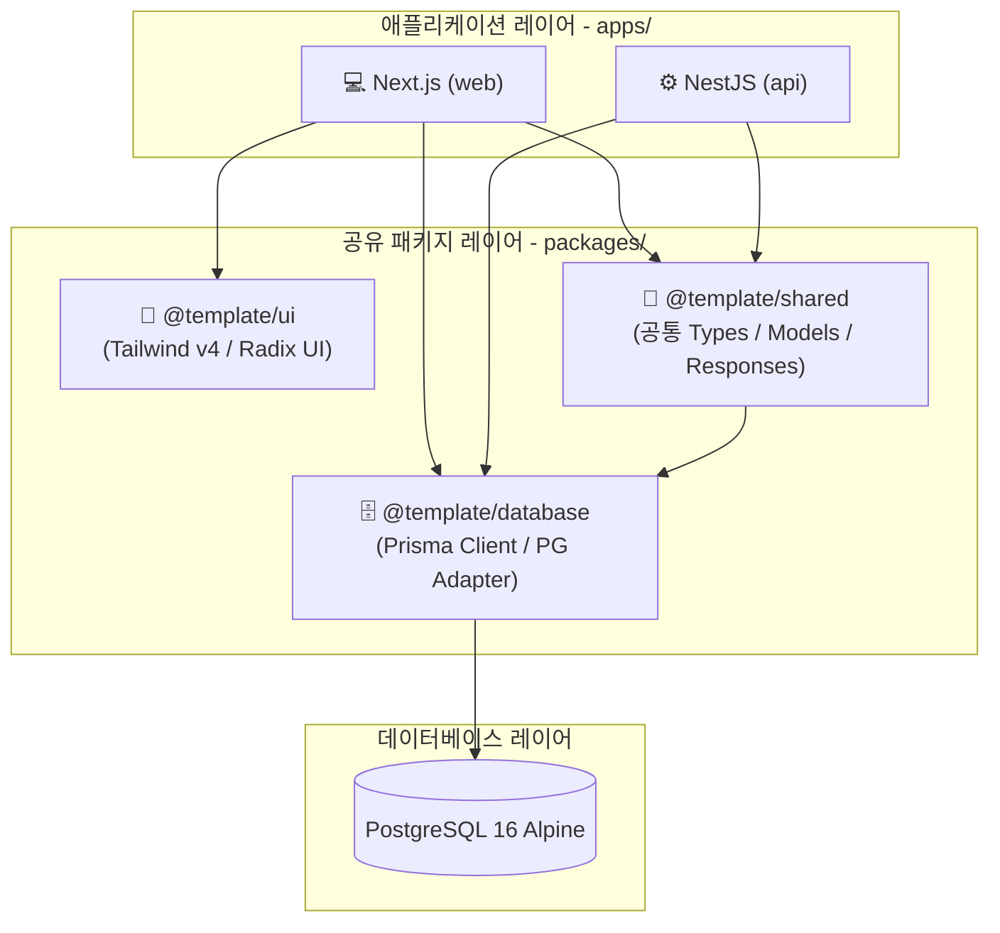

# 🏗️ Monorepo Boilerplate Template

이 프로젝트는 **Next.js (Frontend)**, **NestJS (Backend)**, **Prisma (ORM)**를 기반으로 하는 고성능, 고생산성 Monorepo 개발 템플릿입니다. **Turborepo**와 **pnpm workspace**를 통해 멀티 패키지를 효율적으로 관리하며, 개발(dev) 및 운영(prod) 환경 전체를 Docker Compose 기반으로 가동할 수 있도록 컨테이너화되어 있습니다.

---

## 🗺️ 아키텍처 개요

본 템플릿은 패키지 간의 명확한 역할 분담과 느슨한 결합을 지향합니다.



---

## 🛠️ 기술 스택 (Tech Stack)

### 📦 모노레포 관리 & 빌드 도구
* **Turborepo**: 전체 애플리케이션 및 패키지 파이프라인 빌드 최적화 (캐싱 지원)
* **pnpm Workspace**: 빠르고 효율적인 의존성 관리 및 디스크 공간 절약 (`pnpm@10.10.0`)
* **TypeScript Project References**: 멀티 패키지 환경에서 안전하고 빠른 타입 체킹 (`composite: true`)

### 💻 프론트엔드 (`apps/web`)
* **Next.js v16 (App Router)**: 최신 React 서버 컴포넌트(RSC) 및 최적화된 라우팅
* **Tailwind CSS v4 & PostCSS**: 강력한 최신 CSS 빌드 파이프라인 및 디자인 토큰 제어
* **TanStack Query (React Query) v5**: 선언적 데이터 페칭, 캐싱 및 서버 상태 관리
* **Zustand**: 클라이언트 전역 상태 관리
* **React Hook Form & Hookform Resolvers**: 타입 세이프 폼 관리 및 유효성 검증
* **Framer Motion**: 부드러운 인터랙션 및 화면 전환 애니메이션

### ⚙️ 백엔드 (`apps/api`)
* **NestJS v11**: Scalable한 구조를 보장하는 강력한 Node.js 프레임워크
* **Passport.js & JWT Strategy**: JWT Access Token 및 Refresh Token 기반의 견고한 인증 시스템
* **NestJS Throttler**: OTP/인증 브루트포스 공격 방어용 전역 데코레이터 및 레이트 리밋 (1분당 5회 제한 등)
* **Swagger API 문서화**: `DocumentBuilder`를 활용해 API 엔드포인트 자동 문서화 제공
* **Nodemailer & MailModule**: 이메일 전송 기능 내장
* **Azure Blob Storage / Local File Sync**: 파일 업로드 및 클라우드 동기화 시스템 인프라 구축 (`FileModule`)

### 🗄️ 데이터베이스 (`packages/database`)
* **Prisma ORM v7**: 강력한 타입 안전성을 보장하는 데이터베이스 모델링 및 쿼리 도구
* **PostgreSQL 16**: 안정적이고 신뢰도 높은 RDBMS
* **Prisma Pg Adapter**: 연결 풀링(Connection Pooling)과 가벼운 데이터베이스 연결을 위한 `@prisma/adapter-pg` 기본 탑재
* **Prisma Zod Generator**: Prisma 스키마 기반 Zod 유효성 검사 파일 자동 생성
  > **성능 최적화 설정**: 무한 로딩 및 TypeScript 서버 다운을 유발하는 배럴 파일(`export *`) 생성을 방지하고, 다중 파일 분할 기능(`useMultipleFiles: true`, `writeBarrelFiles: false`)을 적용하여 로컬 IDE 성능을 보존합니다.

---

## 📁 디렉토리 구조 (Directory Structure)

```bash
.
├── Makefile                     # Docker Compose 실행 및 볼륨 정리를 위한 자동화 스크립트
├── turbo.json                   # Turborepo 빌드/파이프라인 캐싱 설정
├── pnpm-workspace.yaml          # pnpm 모노레포 패키지 경로 지정
├── package.json                 # 루트 의존성 및 통합 pnpm 실행 스크립트
├── tsconfig.json                # TypeScript Project References 루트 설정
│
├── apps/                        # 서비스 애플리케이션 영역
│   ├── web/                     # Next.js 프론트엔드 (포트 3001)
│   │   └── src/
│   │       ├── app/             # App Router 및 글로벌 공급자 (globals.css, layout 등)
│   │       ├── views/           # 페이지 템플릿 컴포넌트
│   │       ├── widgets/         # 독립적이고 완성도 높은 기능적 컴포넌트 묶음
│   │       ├── features/        # 사용자의 액션 기반 인터랙션 로직 (폼, 버튼 등)
│   │       ├── entities/        # 비즈니스 도메인 및 데이터 엔티티 단위 (User, Point 등)
│   │       └── shared/          # 공통 컴포넌트 및 유틸리티
│   │
│   └── api/                     # NestJS 백엔드 (포트 3000)
│       └── src/
│           ├── auth/            # 인증 컨트롤러, 서비스, DTO (Access/Refresh, OTP 등)
│           ├── shared/          # 글로벌 모듈, 에러 필터, 가드, 인터셉터 등
│           └── main.ts          # 서버 부트스트랩 및 Prisma DB 커넥션 수립
│
├── packages/                    # 공통 공유 라이브러리 영역
│   ├── database/                # Prisma 스키마 파일 및 Prisma Client 빌드 패키지
│   │   ├── prisma/
│   │   │   └── schema/          # Prisma Multi-Schema (main, user, file.prisma 등)
│   │   └── generated/           # 빌드 시 생성되는 Prisma Client 및 Zod 파일 저장소
│   │
│   ├── shared/                  # 앱 간 공유되는 TypeScript 공통 타입 선언부 (Entity, Response 등)
│   │
│   └── ui/                      # 56종의 Tailwind CSS v4 + Radix UI 디자인 시스템 컴포넌트 라이브러리
│
├── scripts/                     # 유틸리티 스크립트
│   └── rename.sh                # 템플릿 네이밍(@template, PROJECT_NAME 등) 일괄 치환기
├── envs/                        # 환경 변수 폴더
│   └── .env.example             # 환경 변수 템플릿 (유일하게 커밋됨. 실제 .env* 는 gitignore)
└── ci/                          # CI/CD 및 도커 컨테이너 설정 파일 저장소
    ├── docker-composes/         # 환경별 Docker Compose 파일 (dev, prod)
    ├── nginx/                   # 운영용 nginx 리버스 프록시 템플릿 (prod)
    ├── db/                      # DB 초기화 스크립트 (init.sql)
    └── dockers/                 # 서비스별 Dockerfile 정의 (dev, prod, test)
```

---

## 🚀 시작하기 (Getting Started)

### 0. (선택) 템플릿을 내 프로젝트로 리네임

이 템플릿은 npm 스코프 `@template/*`, 루트 패키지명 `template`, `PROJECT_NAME=template-*` 을 기본값으로 씁니다. 실제 프로젝트로 사용할 때는 아래 스크립트로 한 번에 치환하세요.

```bash
# ./scripts/rename.sh <새이름> [스코프]
./scripts/rename.sh myapp          # @myapp/*, name "myapp", PROJECT_NAME myapp-* 로 치환
./scripts/rename.sh myapp acme     # 스코프만 @acme/*, 나머지는 myapp

# 치환 후 반드시 락파일을 재생성 (package.json 변경을 pnpm-lock.yaml 에 반영)
pnpm install
```

스크립트가 한 번에 바꿔주는 것:
* `@template/*` → `@<스코프>/*` — 공유 패키지 3개 정의 + 모든 import 구문
* 루트 `package.json` 의 `"name"`
* `envs/.env*` 의 `PROJECT_NAME` (접미사 `-dev`/`-prod` 는 유지)

> [!IMPORTANT]
> `pnpm-lock.yaml` 은 **커밋 대상**입니다(gitignore 금지). Docker 빌드는 `pnpm install --frozen-lockfile` 로 락파일과 `package.json` 의 일치를 검증하므로, 리네임 후 `pnpm install` 로 락파일을 갱신하지 않으면 빌드가 실패합니다.

---

### 1. 환경 변수 설정

실제 값이 담긴 `.env*` 파일은 커밋되지 않습니다. `envs/.env.example` 을 복사해 환경별 파일을 만드세요.

```bash
cp envs/.env.example envs/.env.dev      # 로컬 개발 (make dev)
cp envs/.env.example envs/.env.prod     # 운영     (make prod)
```

* `PROJECT_NAME`/`NETWORK_NAME` 은 dev/prod 를 다르게 두어 컨테이너·네트워크 충돌을 피하세요.
* JWT 시크릿은 운영에서 반드시 `openssl rand -hex 32` 로 새로 발급해 교체하세요.
* 이메일·Azure Blob 등 선택 기능은 값을 채울 때만 활성화됩니다. 자세한 설명은 `.env.example` 주석 참고.

---

### 2. 개발 환경 실행 (Development)

로컬 개발 환경에서는 자체 도커 네트워크를 기반으로 PostgreSQL, DB 마이그레이션 와처, NestJS 서버, Next.js 프론트엔드가 유기적으로 연동되어 기동됩니다.

#### 1) 의존성 설치 및 Prisma Client/Zod 생성
```bash
pnpm install          # 의존성 설치
pnpm run db:generate  # 데이터베이스 클라이언트 및 Zod 생성
```
> [!IMPORTANT]
> `make dev` 또는 로컬 실행 전, 반드시 `pnpm run db:generate`를 한 번 실행하여 공통 모듈용 `@template/database` 의 `generated` 결과물이 존재하도록 해야 타입 컴파일 에러가 발생하지 않습니다.

#### 2) 로컬 도커 가동
```bash
make dev
```
`envs/.env.dev` 와 도커 네트워크를 적용해 다음 컨테이너들을 기동합니다 (컨테이너명은 `PROJECT_NAME` 접두사를 따름, 기본 `template-dev`):
* **`<PROJECT_NAME>-db`**: PostgreSQL 데이터베이스 (포트 `DB_PORT`, 기본 5432)
* **`db-migrate`**: Prisma Schema 디렉토리(`packages/database/prisma/schema/`) 변화를 Watch 하여 Prisma Client 를 자동 갱신·적용하는 `db:dev` 데몬
* **`<PROJECT_NAME>-server`**: NestJS 백엔드 서버 (포트 `SERVER_PORT`, 기본 3000) — 소스 볼륨 마운트로 핫리로드
* **`<PROJECT_NAME>-web`**: Next.js 프론트엔드 (포트 `WEB_PORT`, 기본 3001) — 핫리로드

---

### 3. 운영 환경 실행 (Production)

운영 이미지는 멀티스테이지 빌드로 최적화됩니다. `api`/`web` 빌드는 Turborepo(`pnpm turbo run build --filter=...`)가 의존성 그래프를 읽어 `database → shared → 앱` 순서를 자동으로 보장합니다.

```bash
make prod
```
`envs/.env.prod` 를 적용해 다음 컨테이너들을 기동합니다 (기본 접두사 `template-prod`):
* **`<PROJECT_NAME>-db`**: PostgreSQL 데이터베이스
* **`<PROJECT_NAME>-api`**: NestJS 백엔드 (기동 시 `prisma migrate deploy` 로 미적용 마이그레이션 반영)
* **`<PROJECT_NAME>-web`**: Next.js 프론트엔드 (Standalone 빌드)
* **`<PROJECT_NAME>-nginx`**: 리버스 프록시 (포트 80/443)

> [!NOTE]
> nginx 는 `envs/.env.prod` 의 `SERVER_NAME` 과 호스트의 `/etc/letsencrypt/live/<SERVER_NAME>/` TLS 인증서를 사용합니다. 실제 HTTPS 서비스를 하려면 해당 도메인의 Let's Encrypt 인증서가 호스트에 준비되어 있어야 합니다.

> [!CAUTION]
> 기존 PostgreSQL 볼륨에 다른 스키마 버전의 데이터가 남아있으면 마이그레이션 충돌이 발생할 수 있습니다.
> 새로 가동할 때는 **`make down`** 으로 Docker 볼륨을 완전히 삭제한 뒤 `make prod` 를 실행하는 것을 권장합니다.

---

## 🛠️ 개발 명령어 모음 (Commands Registry)

| 명령어 | 설명 | 실행 레벨 |
| :--- | :--- | :--- |
| `./scripts/rename.sh <이름> [스코프]` | 템플릿 네이밍(`@template`, 루트명, `PROJECT_NAME`) 일괄 치환 후 `pnpm install` | Host CLI |
| `make dev` | 개발용 컨테이너 기동 (`.env.dev` 사용) | Host CLI |
| `make prod` | 운영용 컨테이너 빌드 및 백그라운드 기동 (`.env.prod` 사용) | Host CLI |
| `make down` | 구동 중인 모든 개발/운영 컨테이너 정지 및 **도커 볼륨 영구 삭제** | Host CLI |
| `pnpm install` | 프로젝트 내 모든 모노레포 패키지 의존성 통합 설치 | Host CLI / Root |
| `pnpm run build` | Turborepo 로 전체 패키지 빌드 (의존성 순서·캐싱 자동 처리) | Host CLI / Root |
| `pnpm run type-check` | 전체 워크스페이스 타입 체크 | Host CLI / Root |
| `pnpm run db:generate` | Prisma 스키마 기반 Prisma Client 및 Zod 타입 생성 | Host CLI / Root |
| `pnpm run web:dev` | 로컬 환경에서 프론트엔드만 개별 실행 (포트 3001) | Host CLI / Root |
| `pnpm run api:dev` | 로컬 환경에서 백엔드만 개별 실행 (포트 3000) | Host CLI / Root |

---

## 🏗️ 개발 가이드라인 (Architecture Guidelines)

### 💻 프론트엔드 개발 규칙 (FSD 아키텍처)
* **FSD (Feature-Sliced Design)** 구조를 엄격히 준수합니다.
* `app/` 레이어는 순수한 Next.js 라우터, 글로벌 스타일 및 프로바이더 주입에 집중하며 페이지 실제 마크업이나 복잡한 비즈니스 로직은 작성하지 않습니다.
* 페이지 메인 뷰는 `views/` 레이어 아래 컴포넌트로 분리하고 `app/page.tsx`는 분리된 뷰를 가져와 단순 렌더링하는 진입점 역할만 담당합니다.
* **공통 UI 컴포넌트 제약**: UI 컴포넌트는 개별 웹앱 내부가 아닌 `packages/ui`에서 `@template/ui`를 통해 불러와 사용하며, 원본 UI 컴포넌트 코드의 ad-hoc 수정은 지양합니다.

### ⚙️ 백엔드 개발 규칙 (구조적 통일화)
* **API 구조 표준**: 모든 Response는 `BaseResponse<T>` 인터페이스 규격(성공 시 `result: true, message, data`, 실패 시 `result: false, message, data: HttpError`)을 만족해야 합니다.
  * 글로벌 필터 `HttpErrorFilter` 및 인터셉터 `TransformInterceptor`가 이를 자동으로 포매팅합니다.
* **인증 시스템**:
  * 모든 API 엔드포인트는 기본적으로 `@UseGuards(JwtAccessGuard)`가 전역 적용되어 보호됩니다. 인증이 필요 없는 공개 엔드포인트의 경우 `@Public()` 커스텀 데코레이터를 명시해주어야 합니다.
  * OTP 등 민감한 인증 시도 구간은 브루트포스 예방을 위해 `ThrottlerGuard` 가드가 동시에 적용되어 있습니다.

### 🗄️ 데이터베이스 스키마 수정 규칙
* 데이터베이스 설계 변경 시 `packages/database/prisma/schema` 폴더 아래 각 영역별 파일(예: `user.prisma`, `file.prisma` 등)을 수정하거나 생성합니다.
* 파일 수정 후 `pnpm run db:generate` 명령을 통해 로컬 타이핑을 갱신해 주어야 합니다.

### 🔀 마이그레이션 워크플로 (Migrations)

스키마 이력은 `packages/database/prisma/migrations/` 가 **단일 진실 소스**입니다. 운영(`migrate deploy`)과 e2e 테스트가 이 마이그레이션을 적용하므로, 스키마 변경은 반드시 마이그레이션으로 기록해야 운영에 반영됩니다.

| 상황 | 명령 |
| :--- | :--- |
| 로컬에서 빠르게 스키마 실험 (이력 X) | `pnpm --filter @template/database db:push` |
| 스키마 확정 → 마이그레이션 기록 | `pnpm --filter @template/database db:migrate --name <변경명>` |
| 운영/CI 에서 마이그레이션 적용 | `pnpm --filter @template/database db:deploy` (운영은 컨테이너 기동 시 자동 실행) |

> [!CAUTION]
> **기존 DB 를 마이그레이션으로 전환할 때(베이스라이닝):** 이 저장소는 `db push` 로 스키마를 관리하다 `0_init` 마이그레이션을 도입했습니다. 이미 `db push` 로 테이블이 생성된 **기존 운영/개발 DB** 에 곧바로 `migrate deploy` 를 실행하면 "테이블이 이미 존재" 오류가 납니다. 해당 DB 에 최초 1회만 아래로 베이스라인을 잡아주세요(테이블은 그대로 두고 이력만 기록):
> ```bash
> DATABASE_URL=<대상 DB> pnpm --filter @template/database exec prisma migrate resolve --applied 0_init
> ```
> 볼륨을 새로 만드는 신규 환경(및 fork)은 이 단계가 필요 없습니다 — `migrate deploy` 가 빈 DB 에 `0_init` 을 그대로 적용합니다.
